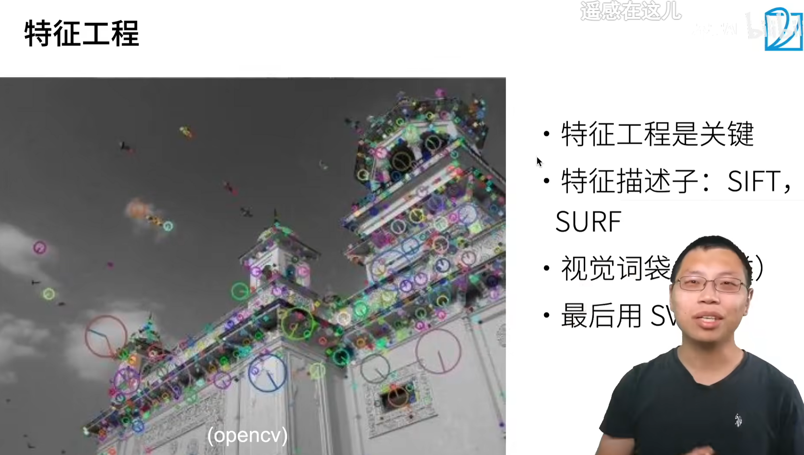
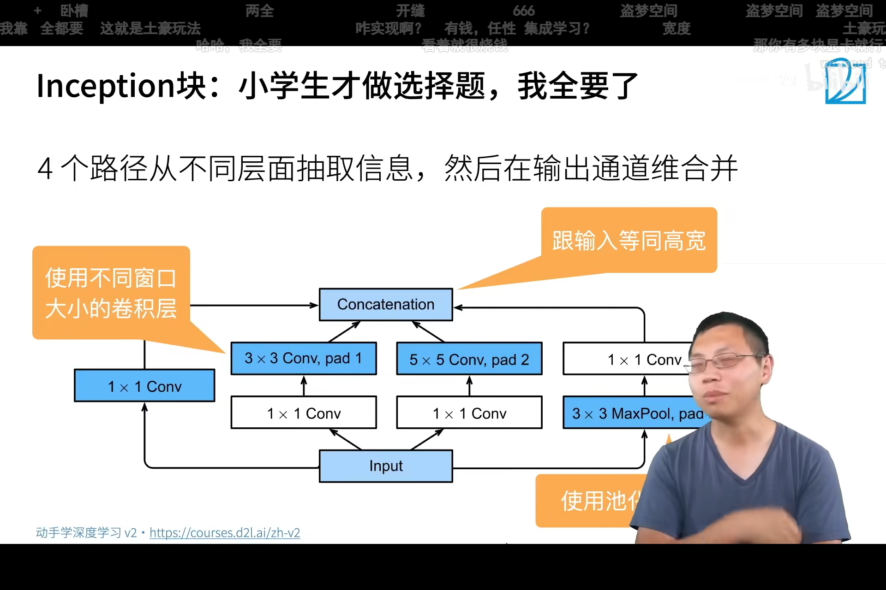

<!--
 * @Author       : JonnyZhang 71881972+jonnyzhang02@users.noreply.github.com
 * @LastEditTime : 2023-07-25 11:14
 * @FilePath     : \d2l-zh-pytorch\chapter_convolutional-modern\.md
 * 
 * coded by ZhangYang@BUPT, my email is zhangynag0207@bupt.edu.cn
-->
# 现代卷积神经网络

<!-- TOC -->

- [现代卷积神经网络](#%E7%8E%B0%E4%BB%A3%E5%8D%B7%E7%A7%AF%E7%A5%9E%E7%BB%8F%E7%BD%91%E7%BB%9C)
    - [AlexNet](#alexnet)
        - [背景](#%E8%83%8C%E6%99%AF)
        - [AlexNet模型](#alexnet%E6%A8%A1%E5%9E%8B)
        - [AlexNet代码](#alexnet%E4%BB%A3%E7%A0%81)
    - [使用块的网络VGG](#%E4%BD%BF%E7%94%A8%E5%9D%97%E7%9A%84%E7%BD%91%E7%BB%9Cvgg)
        - [VGG模型](#vgg%E6%A8%A1%E5%9E%8B)
        - [VGG代码](#vgg%E4%BB%A3%E7%A0%81)
    - [网络中的网络 NiN](#%E7%BD%91%E7%BB%9C%E4%B8%AD%E7%9A%84%E7%BD%91%E7%BB%9C-nin)
        - [NiN模型](#nin%E6%A8%A1%E5%9E%8B)
        - [NIN代码](#nin%E4%BB%A3%E7%A0%81)
    - [GoogLeNet](#googlenet)
        - [Inception块](#inception%E5%9D%97)
        - [GoogLeNet模型](#googlenet%E6%A8%A1%E5%9E%8B)
            - [段1-2](#%E6%AE%B51-2)
            - [段3](#%E6%AE%B53)
            - [段4-5](#%E6%AE%B54-5)
        - [后续版本](#%E5%90%8E%E7%BB%AD%E7%89%88%E6%9C%AC)
        - [GoogLeNet代码](#googlenet%E4%BB%A3%E7%A0%81)
    - [批量归一化 Batch Normalization](#%E6%89%B9%E9%87%8F%E5%BD%92%E4%B8%80%E5%8C%96-batch-normalization)
        - [批量归一化层](#%E6%89%B9%E9%87%8F%E5%BD%92%E4%B8%80%E5%8C%96%E5%B1%82)
        - [批量归一化代码](#%E6%89%B9%E9%87%8F%E5%BD%92%E4%B8%80%E5%8C%96%E4%BB%A3%E7%A0%81)
    - [残差网络 ResNet](#%E6%AE%8B%E5%B7%AE%E7%BD%91%E7%BB%9C-resnet)
        - [残差块 Rsidual Block](#%E6%AE%8B%E5%B7%AE%E5%9D%97-rsidual-block)
        - [ResNet代码](#resnet%E4%BB%A3%E7%A0%81)

<!-- /TOC -->

## AlexNet

输入(batch_size, 3, 224, 224)

下面是batch_size=1


[论文](https://papers.nips.cc/paper/2012/file/c399862d3b9d6b76c8436e924a68c45b-Paper.pdf)

### 背景

（2012年）

2000年初期的主流算法是核方法。


10-15年前：



计算和数据增长很快。计算增长更快。


### AlexNet模型


改变了人们的观念，不再由人提取特征。

量变引起质变。


总结


### AlexNet代码

[notebook](./alexnet.ipynb)


## 使用块的网络VGG

### VGG模型

（2013年）

AlexNet的问题：长得太丑了。长得不规则。


VGG的思想：将卷积层组合为块。


更多的3*3好于 5\*5 ,深但窄。


### VGG代码

VGG是一个很贵的网络，因为它的计算量很大。

[notebook](./vgg.ipynb)

## 网络中的网络 NiN

### NiN模型

用得不多。但提出了一些重要概念。


使用1*1卷积层，起到全连接层的作用。


混合通道。


### NIN代码

[notebook](./nin.ipynb)

## GoogLeNet

GoogLeNet很好地使用了1*1卷积层。

第一个超过100层的卷积神经网络。


### Inception块



输出的通道数是所有分支输出通道数之和。

但**不改变高和宽**。


作者从来没说过这些通道数是怎么来的。

这味药抓一点，那味药抓一点，最后混合在一起。


### GoogLeNet模型


#### 段1-2


把通道数拉上去，把高宽减下来。

```mermaid

graph TD

A[3,224,224] -->|7*7 Conv 64 stride 2 pad 3| B[64,112,112]
B --> |3*3 MaxPool| C[64,56,56]
C --> |1*1 Conv 64| D[64,56,56]
D --> |3*3 Conv 192 pad 1| E[192,56,56]
E --> |3*3 MaxPool stride 2 pad 1| F[192,28,28]

```

#### 段3


#### 段4-5


### 后续版本


V3 效果比较好。还是被经常使用。

### GoogLeNet代码

[notebook](./googlenet.ipynb)

## 批量归一化 Batch Normalization

### 批量归一化层

这个特定的层大约是2016年才有的。 

几乎所有的网络都使用了批量归一化。


上面的东西很快收敛，下面的东西较慢收敛。

上面的一般是高级语义。

$B$是Batch_Size。

可以学习一个新的标准差$\gamma$和均值$\beta$。（又被称为拉伸scale和偏移shift）


批量归一化是一个线性变换，所以可以放在卷积层和激活函数之间。

对于全连接层，作用的是特征维。即一个样本的所有特征。

一个像素的不同通道的值，可以看成是一个样本。这就是所谓作用在通道维。


使用后可以允许使用**更大的学习率**。


优点：

**加速训练**：由于可以使用较大的学习率，收敛速度更快。

减少梯度消失问题：可以帮助缓解梯度消失问题，使得更深的网络可以训练。

正则化效果：在一定程度上**具有正则化的效果**，减少了对Dropout等正则化技术的需求。

使权重初始化较不敏感：较好地解决了权重初始化问题，使得初始化的选择不再那么重要。

### 批量归一化代码

[notebook](./batch-norm.ipynb)

## 残差网络 ResNet

如果你只想要了解一个卷积神经网络，那就是ResNet。


更复杂的模型不一定更好。可能学偏了。

这就是所谓的**模型偏差**。

### 残差块 Rsidual Block


加一个x可以保证至少我还有原来学习到的东西。

这样可以避免随着层数的增加，越学越偏。


炼丹


两种ResNet块：高宽不变，高宽减半。


一般 ResNet 512 用来刷榜。


之后的网络BERT和Transformer都使用了ResNet的思想。


### ResNet代码

[notebook](./resnet.ipynb)


