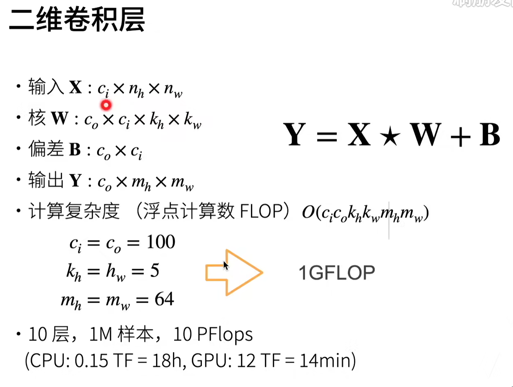

<!--
 * @Author       : JonnyZhang 71881972+jonnyzhang02@users.noreply.github.com
 * @LastEditTime : 2023-07-24 11:36
 * @FilePath     : \d2l-zh-pytorch\chapter_convolutional-neural-networks\.md
 * 
 * coded by ZhangYang@BUPT, my email is zhangynag0207@bupt.edu.cn
-->
# 卷积神经网络

<!-- TOC -->

- [卷积神经网络](#%E5%8D%B7%E7%A7%AF%E7%A5%9E%E7%BB%8F%E7%BD%91%E7%BB%9C)
    - [从全连接神经网络到卷积神经网络](#%E4%BB%8E%E5%85%A8%E8%BF%9E%E6%8E%A5%E7%A5%9E%E7%BB%8F%E7%BD%91%E7%BB%9C%E5%88%B0%E5%8D%B7%E7%A7%AF%E7%A5%9E%E7%BB%8F%E7%BD%91%E7%BB%9C)
        - [四维的全连接层](#%E5%9B%9B%E7%BB%B4%E7%9A%84%E5%85%A8%E8%BF%9E%E6%8E%A5%E5%B1%82)
        - [关于平移不变性](#%E5%85%B3%E4%BA%8E%E5%B9%B3%E7%A7%BB%E4%B8%8D%E5%8F%98%E6%80%A7)
        - [局部性](#%E5%B1%80%E9%83%A8%E6%80%A7)
    - [卷积层](#%E5%8D%B7%E7%A7%AF%E5%B1%82)
        - [卷积层代码](#%E5%8D%B7%E7%A7%AF%E5%B1%82%E4%BB%A3%E7%A0%81)
    - [卷积层的填充和步幅](#%E5%8D%B7%E7%A7%AF%E5%B1%82%E7%9A%84%E5%A1%AB%E5%85%85%E5%92%8C%E6%AD%A5%E5%B9%85)
        - [填充（padding）](#%E5%A1%AB%E5%85%85padding)
        - [步幅（stride）](#%E6%AD%A5%E5%B9%85stride)
        - [padding代码](#padding%E4%BB%A3%E7%A0%81)
    - [多个输入和输出通道](#%E5%A4%9A%E4%B8%AA%E8%BE%93%E5%85%A5%E5%92%8C%E8%BE%93%E5%87%BA%E9%80%9A%E9%81%93)
        - [多个输入通道](#%E5%A4%9A%E4%B8%AA%E8%BE%93%E5%85%A5%E9%80%9A%E9%81%93)
        - [多个输出通道](#%E5%A4%9A%E4%B8%AA%E8%BE%93%E5%87%BA%E9%80%9A%E9%81%93)
        - [一乘一卷积核](#%E4%B8%80%E4%B9%98%E4%B8%80%E5%8D%B7%E7%A7%AF%E6%A0%B8)
        - [总结](#%E6%80%BB%E7%BB%93)
        - [多通道代码](#%E5%A4%9A%E9%80%9A%E9%81%93%E4%BB%A3%E7%A0%81)
    - [池化层](#%E6%B1%A0%E5%8C%96%E5%B1%82)
        - [二维最大池化](#%E4%BA%8C%E7%BB%B4%E6%9C%80%E5%A4%A7%E6%B1%A0%E5%8C%96)
        - [平均池化](#%E5%B9%B3%E5%9D%87%E6%B1%A0%E5%8C%96)
        - [pooling代码](#pooling%E4%BB%A3%E7%A0%81)
    - [LeNet](#lenet)
        - [LeNet代码](#lenet%E4%BB%A3%E7%A0%81)

<!-- /TOC -->

## 从全连接神经网络到卷积神经网络

平移不变性：图像中的物体不管出现在图像的哪个位置，都应该被识别为同一个物体。

局部性：图像中的一个区域与图像中的另一个区域相比，它们更可能有相似的语义。

如何通过全连接层引申到卷积层？

卷积层是一种特殊的全连接层。

### 四维的全连接层

即所有的层的神经元变为一个矩阵排列，每个神经元与前面所有的神经元链接。这样就有（h’ * w‘)个神经元与前面的（h * w) 个神经元相连，这就是所谓的4-D权重。

所谓的重新索引，就是求和的时候，先让前两个索引不变，后两个变化，然后求和。

相当于原来是按照**前一层的从第一个神经元开始的输出顺序来求和**,现在是按照从后一层的当前计算神经元对应位置开始来求和。

### 关于平移不变性

所谓v不应该依赖于（i，j），就是说，如果x平移了，v不应该变化。

所谓$v_{a,b}$就是卷积核内的元素。

### 局部性

只应该与其附近的像素有关。

所谓$\Delta$就是表征的卷积核的大小。

**对全连接层使用平移不变性和局部性得到卷积层**。

## 卷积层

损失的是$k_h-1$和$k_w-1$个像素，所以输出的大小为$h-k_h+1$和$w-k_w+1$。

不同的卷积核能实现一些不同的功能。

一维和三维：

### 卷积层代码

[notebook](./conv-layer.ipynb)

## 卷积层的填充和步幅

### 填充（padding）

使用卷积核会缩减图像的大小，所以可以使用填充来保持图像的大小。

在输入的周围添加额外的行/列。

可以使输出相对输入不变或变大。

具体输出情况以计算而定：

通常会选择**核的长和宽减一**作为填充的大小。

且通常对称。

我们一般不会使用偶数大小的卷积核。

### 步幅（stride）

往右和往下移动的步长可以不一样。

具体计算，最后不够了就丢掉。

### padding代码

[notebook](./padding-and-strides.ipynb)

## 多个输入和输出通道

### 多个输入通道

彩色图像有三个通道，转换为灰度图像会丢失信息。

输出仍为一个通道的话，就是对各个通道的输出求和。

### 多个输出通道

我们可以有**多个** **与输入通道数相同**的卷积核。

输出通道数就是**卷积核的个数**。

### 一乘一卷积核

1*1 卷积层 他就是一个全连接层。

### 总结

一般而言：

kernel通道数 = input通道数。

output通道数 = kernel**个数**。

$c_i$:输入通道数

$n_k * n_w$: 输入的高和宽

$c_o$：卷积核个数

$k_h * k_w$: 卷积核的高和宽

$m_h * m_w$: 输出的高和宽

### 多通道代码

[notebook](./channels.ipynb)

## 池化层

卷积层对位置敏感，池化层可以缓解这种敏感性。

一般用在卷积层之后。

### 二维最大池化

不像卷积一样可以融合多输入通道。

### 平均池化

### pooling代码

[notebook](./pooling.ipynb)

## LeNet

### LeNet代码

[notebook](./lenet.ipynb)

