<!--
 * @Author       : JonnyZhang 71881972+jonnyzhang02@users.noreply.github.com
 * @LastEditTime : 2023-07-18 20:40
 * @FilePath     : \d2l-zh-pytorch\chapter_linear-networks\.md
 * 
 * coded by ZhangYang@BUPT, my email is zhangynag0207@bupt.edu.cn
-->
<!-- TOC -->

- [线性回归](#%E7%BA%BF%E6%80%A7%E5%9B%9E%E5%BD%92)
    - [线性回归](#%E7%BA%BF%E6%80%A7%E5%9B%9E%E5%BD%92)
    - [基础优化算法](#%E5%9F%BA%E7%A1%80%E4%BC%98%E5%8C%96%E7%AE%97%E6%B3%95)
    - [线性回归的从零开始实现](#%E7%BA%BF%E6%80%A7%E5%9B%9E%E5%BD%92%E7%9A%84%E4%BB%8E%E9%9B%B6%E5%BC%80%E5%A7%8B%E5%AE%9E%E7%8E%B0)
        - [torch.matmul函数](#torchmatmul%E5%87%BD%E6%95%B0)
            - [具体执行过程](#%E5%85%B7%E4%BD%93%E6%89%A7%E8%A1%8C%E8%BF%87%E7%A8%8B)
        - [其他矩阵相乘函数](#%E5%85%B6%E4%BB%96%E7%9F%A9%E9%98%B5%E7%9B%B8%E4%B9%98%E5%87%BD%E6%95%B0)
    - [线性回归的简洁实现](#%E7%BA%BF%E6%80%A7%E5%9B%9E%E5%BD%92%E7%9A%84%E7%AE%80%E6%B4%81%E5%AE%9E%E7%8E%B0)
- [softmax回归](#softmax%E5%9B%9E%E5%BD%92)
    - [softmax介绍](#softmax%E4%BB%8B%E7%BB%8D)
    - [损失函数](#%E6%8D%9F%E5%A4%B1%E5%87%BD%E6%95%B0)
        - [均方损失](#%E5%9D%87%E6%96%B9%E6%8D%9F%E5%A4%B1)
        - [L1 损失](#l1-%E6%8D%9F%E5%A4%B1)
        - [Huber 损失](#huber-%E6%8D%9F%E5%A4%B1)
    - [图像分类数据集fashion MNIST](#%E5%9B%BE%E5%83%8F%E5%88%86%E7%B1%BB%E6%95%B0%E6%8D%AE%E9%9B%86fashion-mnist)
    - [Softmax回归的从零开始实现](#softmax%E5%9B%9E%E5%BD%92%E7%9A%84%E4%BB%8E%E9%9B%B6%E5%BC%80%E5%A7%8B%E5%AE%9E%E7%8E%B0)
        - [交叉熵损失函数](#%E4%BA%A4%E5%8F%89%E7%86%B5%E6%8D%9F%E5%A4%B1%E5%87%BD%E6%95%B0)
    - [Softmax回归的简洁实现](#softmax%E5%9B%9E%E5%BD%92%E7%9A%84%E7%AE%80%E6%B4%81%E5%AE%9E%E7%8E%B0)

<!-- /TOC -->

# 线性回归

## [线性回归](./linear-regression.ipynb)

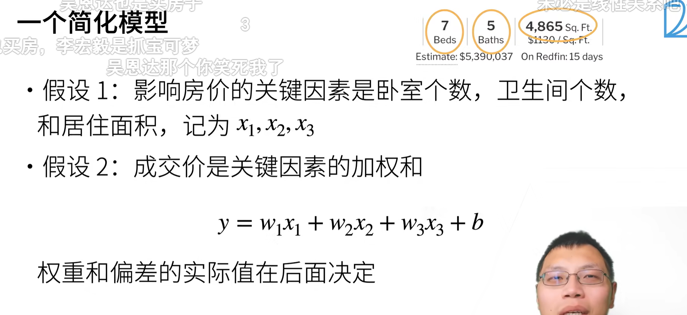

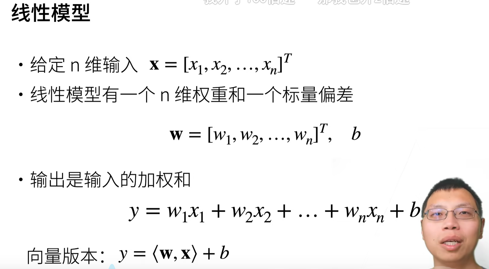

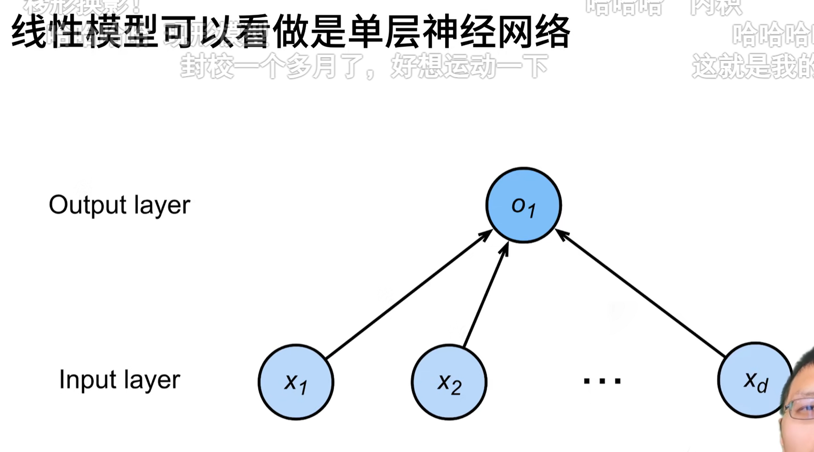

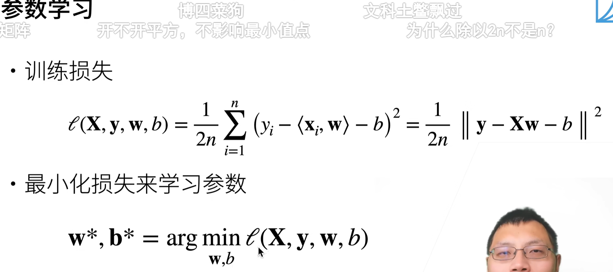

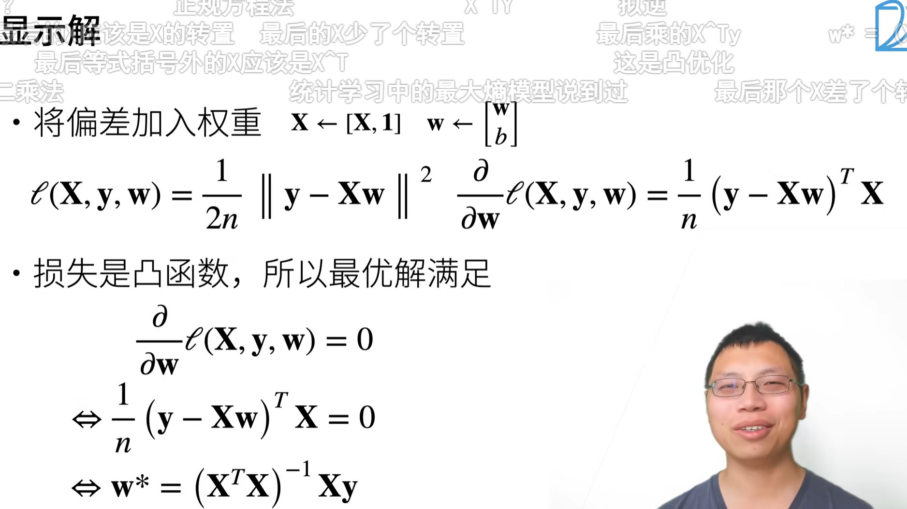

唯一有最优解的模型是线性模型，因为它是一个凸函数，而凸函数的局部最优解也是全局最优解。

## [基础优化算法]()

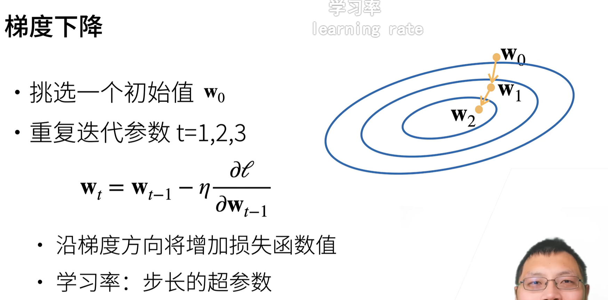

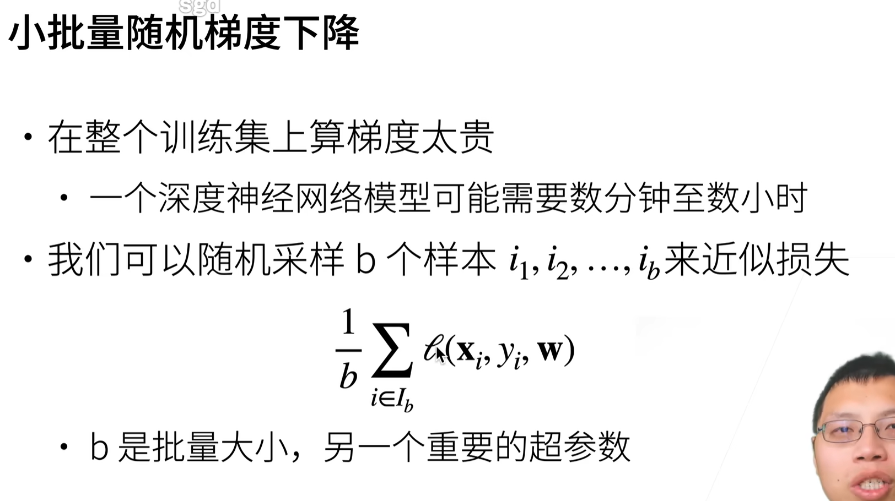

用一部分数据的平均损失来估计总体损失，这叫做**小批量随机梯度下降**。最稳定也最简单，默认的损失计算方法。

## [线性回归的从零开始实现](./linear-regression-scratch.ipynb)

在PyTorch中，有几种方法可以进行矩阵相乘操作。以下是其中几种常见的方法：

### 1. `torch.matmul`函数

`torch.matmul`: 这是PyTorch提供的主要矩阵相乘函数。它可以用于两个张量（可以是标量、向量、矩阵或多维张量）之间的相乘操作。`torch.matmul`函数**可以处理不同形状的输入张量，自动执行广播和批量操作**。对于二维矩阵相乘，可以使用该函数，如`torch.matmul(tensor1, tensor2)`。

`torch.matmul`函数执行的是矩阵相乘运算，根据输入张量的形状和维度的不同，它可以进行以下几种类型的矩阵相乘运算：

1. **两个二维矩阵的相乘**：如果两个输入张量都是二维矩阵，例如形状为 `(m, n)` 和 `(n, p)`，则 `torch.matmul` 函数会执行标准的矩阵乘法运算，输出一个形状为 `(m, p)` 的结果矩阵。

2. **矩阵和向量的相乘**：如果其中一个输入张量是二维矩阵，另一个是**一维张量**，例如形状为 `(m, n)` 的矩阵和形状为 `(n,)` 的向量，则 `torch.matmul` 函数**会将向量视为列向量，将矩阵看成是行向量的集合**，执行矩阵乘法运算，**输出一个形状为 `(m,)` 的结果向量**。

3. **批量矩阵相乘**：如果输入张量的形状具有批次维度（batch dimension），例如形状为 `(batch_size, m, n)` 和 `(batch_size, n, p)`，则 `torch.matmul` 函数会在批次维度上执行矩阵乘法运算，即对每个批次中的矩阵进行相乘操作。输出的结果张量形状为 `(batch_size, m, p)`。

4. **张量广播和批量矩阵相乘**：如果输入张量的形状可以通过广播（broadcasting）扩展为匹配的形状，例如形状为 `(m, n)` 和 `(n, p)`，则 `torch.matmul` 函数会自动执行广播操作，并在批次维度上执行矩阵乘法运算。输出的结果张量形状为 `(m, p)`。

需要注意的是，`torch.matmul`函数并不执行逐元素乘法（element-wise multiplication），而是执行矩阵乘法运算。如果需要执行逐元素乘法，可以使用`*`运算符。


#### 具体执行过程

**属于上面的情况二**

当你执行 `torch.matmul` 运算符来计算一个形状为 `torch.Size([1000, 2])` 的张量和一个形状为 `tensor([2.0000, -3.4000])` 的张量时，PyTorch 会自动进行广播操作，将第二个张量广播到与第一个张量的形状匹配。

首先，PyTorch 将形状为 `torch.Size([1000, 2])` 的张量视为一个包含 1000 个形状为 `(2,)` 的向量组成的矩阵。然后，它会执行矩阵乘法运算，将这个矩阵和形状为 `(2,)` 的向量进行相乘。

具体过程如下：

1. 将形状为 `torch.Size([1000, 2])` 的张量视为一个包含 1000 个形状为 `(2,)` 的向量组成的矩阵。

2. 将形状为 `(2,)` 的向量视为列向量，得到一个形状为 `(2, 1)` 的矩阵。

3. 执行矩阵乘法运算，将形状为 `torch.Size([1000, 2])` 的矩阵和形状为 `(2, 1)` 的矩阵相乘。

4. 输出结果为一个形状为 `torch.Size([1000, 1])` 的张量，即一个包含 1000 个形状为 `(1,)` 的向量组成的矩阵。

简而言之，`torch.matmul` 运算符会将第二个张量广播到与第一个张量的形状匹配，并执行矩阵乘法运算。在本例中，输出结果将是一个形状为 `torch.Size([1000, 1])` 的张量。

### 2. 其他矩阵相乘函数

2. `torch.mm`: 这是一个专门用于执行**两个二维矩阵相乘**的函数。它要求输入张量是二维的，并且对于相乘的矩阵形状必须满足**内积维度的要求**。可以使用`torch.mm(tensor1, tensor2)`进行二维矩阵相乘操作。

3. `torch.dot`: 这是用于计算两个一维张量的点积的函数。它要求输入张量是一维的，并且长度必须相等。可以使用`torch.dot(tensor1, tensor2)`进行一维张量的点积操作。

4. `*` 运算符：在PyTorch中，使用`*`运算符进行矩阵相乘会执行逐元素乘法（element-wise multiplication），也称为Hadamard积。这意味着对应位置的元素相乘得到的结果组成了新的张量，要求两个张量的形状必须相同。可以使用`result = tensor1 * tensor2`进行逐元素乘法操作。

总结一下，`torch.matmul`和`torch.mm`用于矩阵相乘操作，`torch.matmul`更通用，能够处理多种形状的输入张量。`torch.dot`用于计算一维张量的点积。而`*`运算符用于执行逐元素乘法操作。

## [线性回归的简洁实现](./linear-regression-consise.ipynb)

```python
def load_array(data_arrays, batch_size, is_train=True):  
    """构造一个PyTorch数据迭代器"""
    dataset = data.TensorDataset(*data_arrays)
    print(dataset[0])
    # shuffle: 是否需要打乱数据
    return data.DataLoader(dataset, batch_size, shuffle=is_train)

batch_size = 10
data_iter = load_array((features, labels), batch_size)

next(iter(data_iter))
```
这段代码是构造一个PyTorch的数据迭代器(DataLoader)来加载数据数组并生成mini-batch。

主要步骤:

1. data_arrays是一个元组,包含了特征(features)和标签(labels)等数据数组。

2. **使用data.TensorDataset()来把这些数组打包成一个数据集(dataset)**。

3. 设置batch_size来指定每个mini-batch的样本数。 

4. **DataLoader会每次yield一个mini-batch的数据**。

5. shuffle参数控制是否需要打乱数据。在训练时设为True,测试时设为False。

6. 调用next(iter(data_iter))会读取一个mini-batch的数据。

7. 打印dataset[0]可以查看数据集中的第一个样本包含了哪些内容。

这里构造了一个batch_size为10的数据迭代器data_iter,调用next(iter(data_iter))会读取第一个包含10个样本的mini-batch。

# softmax回归

**回归**问题的输出是一个**连续值**，而**分类**问题的输出是一个**离散值**。

在分类问题中，我们可以根据概率最大的类别作为预测输出，这种方法叫做**最大似然估计**。

##  softmax介绍

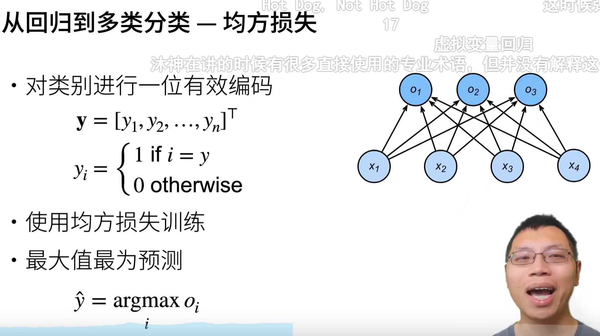

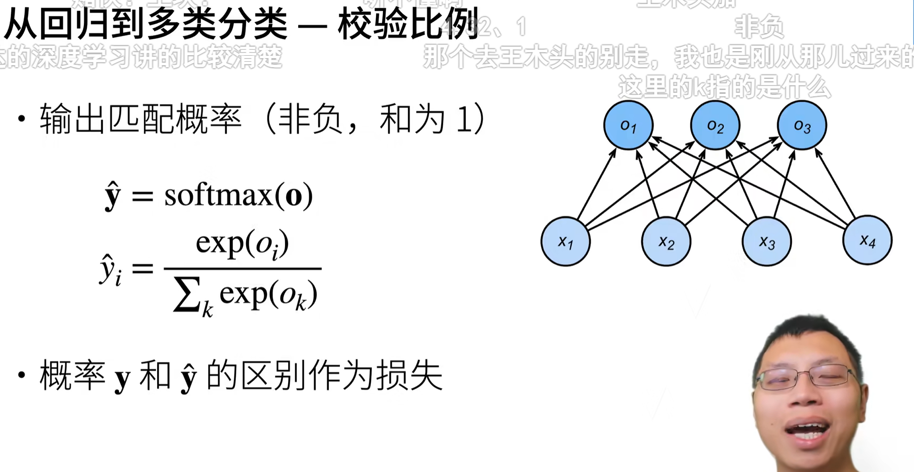

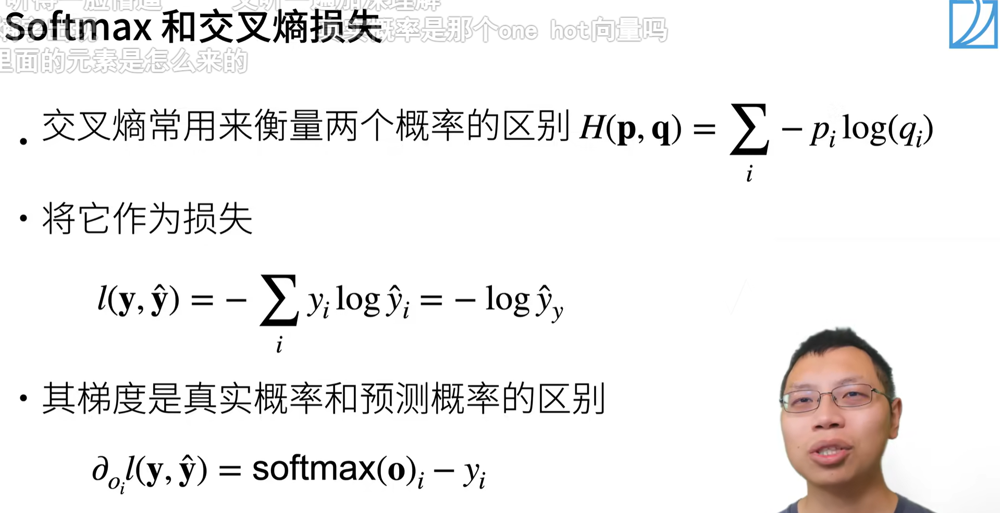

最终损失只和正确的那一类对应的输出有关,舍弃了其他类别的输出。

## 损失函数

### 均方损失

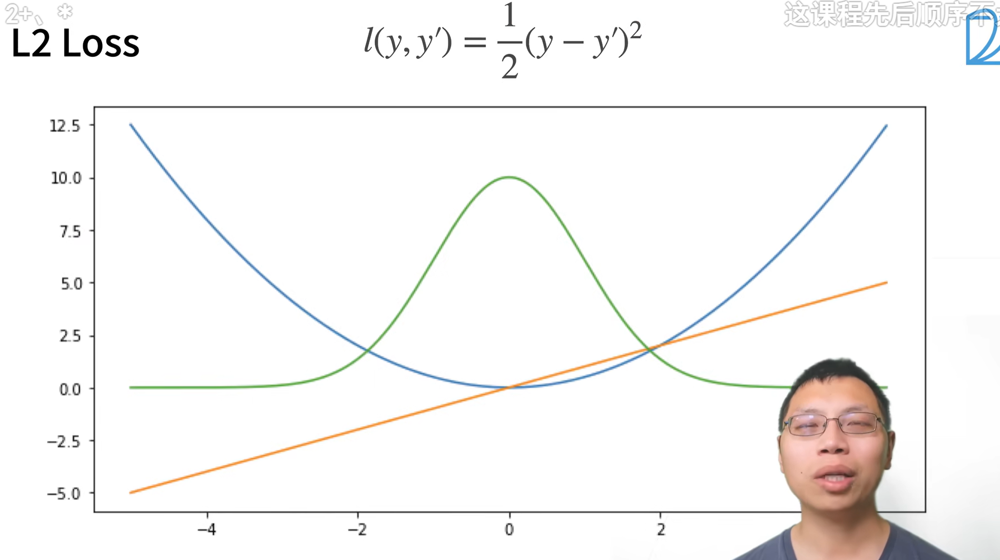

除以二是为了求导的时候系数可以抵消。 

蓝色的是均方损失值

橙色的是似然函数，是一个高斯分布

橙色的线是梯度，是一个过原点的线性函数

### L1 损失

绝对值

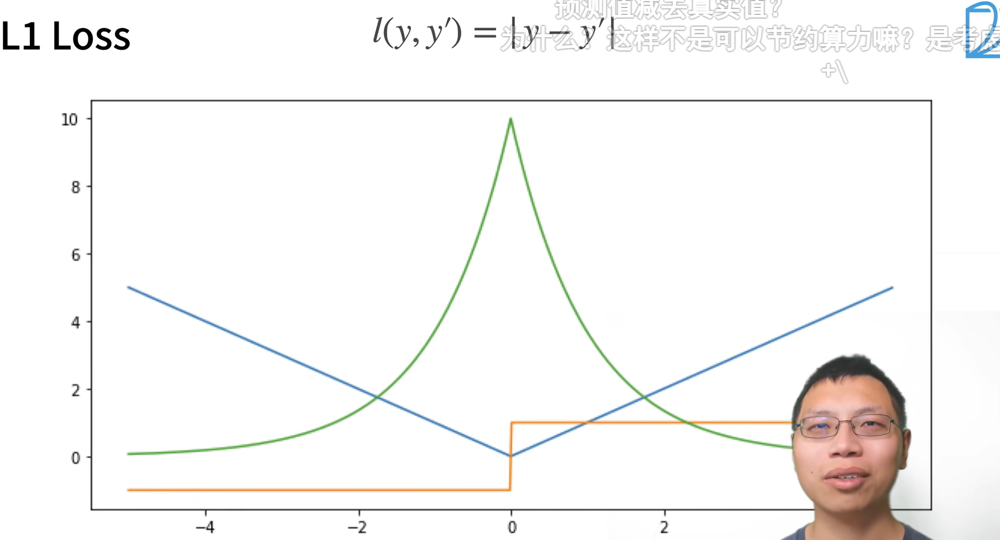

就算隔得很远，梯度也不会很大，避免梯度爆炸

缺点是，0附近的梯度不连续

### Huber 损失

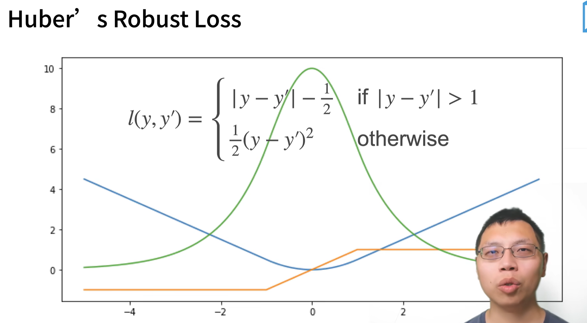


## [图像分类数据集fashion MNIST](./image-classification-dataset.ipynb)

## [Softmax回归的从零开始实现](./softmax-regression-scratch.ipynb)

### 交叉熵损失函数


舍弃了其他类别的输出。

## [Softmax回归的简洁实现](./softmax-regression-consise.ipynb)


