<!--
 * @Author       : JonnyZhang 71881972+jonnyzhang02@users.noreply.github.com
 * @LastEditTime : 2023-07-23 17:39
 * @FilePath     : \d2l-zh-pytorch\chapter_multilayer-perceptrons\.md
 * 
 * coded by ZhangYang@BUPT, my email is zhangynag0207@bupt.edu.cn
-->

<!-- TOC -->

- [感知机](#%E6%84%9F%E7%9F%A5%E6%9C%BA)
    - [多层感知机从零开始实现](#%E5%A4%9A%E5%B1%82%E6%84%9F%E7%9F%A5%E6%9C%BA%E4%BB%8E%E9%9B%B6%E5%BC%80%E5%A7%8B%E5%AE%9E%E7%8E%B0)
    - [多层感知机简洁实现](#%E5%A4%9A%E5%B1%82%E6%84%9F%E7%9F%A5%E6%9C%BA%E7%AE%80%E6%B4%81%E5%AE%9E%E7%8E%B0)
    - [模型选择](#%E6%A8%A1%E5%9E%8B%E9%80%89%E6%8B%A9)
        - [K折交叉验证](#k%E6%8A%98%E4%BA%A4%E5%8F%89%E9%AA%8C%E8%AF%81)
    - [欠拟合和过拟合](#%E6%AC%A0%E6%8B%9F%E5%90%88%E5%92%8C%E8%BF%87%E6%8B%9F%E5%90%88)
    - [正则化方法](#%E6%AD%A3%E5%88%99%E5%8C%96%E6%96%B9%E6%B3%95)
        - [权重衰退](#%E6%9D%83%E9%87%8D%E8%A1%B0%E9%80%80)
            - [L1正则化](#l1%E6%AD%A3%E5%88%99%E5%8C%96)
            - [L2正则化](#l2%E6%AD%A3%E5%88%99%E5%8C%96)
        - [丢弃法](#%E4%B8%A2%E5%BC%83%E6%B3%95)
    - [数值稳定性和模型初始化](#%E6%95%B0%E5%80%BC%E7%A8%B3%E5%AE%9A%E6%80%A7%E5%92%8C%E6%A8%A1%E5%9E%8B%E5%88%9D%E5%A7%8B%E5%8C%96)
        - [数值稳定性](#%E6%95%B0%E5%80%BC%E7%A8%B3%E5%AE%9A%E6%80%A7)
        - [模型初始化和激活函数提高数值稳定性](#%E6%A8%A1%E5%9E%8B%E5%88%9D%E5%A7%8B%E5%8C%96%E5%92%8C%E6%BF%80%E6%B4%BB%E5%87%BD%E6%95%B0%E6%8F%90%E9%AB%98%E6%95%B0%E5%80%BC%E7%A8%B3%E5%AE%9A%E6%80%A7)
            - [权重初始化](#%E6%9D%83%E9%87%8D%E5%88%9D%E5%A7%8B%E5%8C%96)
            - [激活函数](#%E6%BF%80%E6%B4%BB%E5%87%BD%E6%95%B0)
    - [Kaggle房价预测](#kaggle%E6%88%BF%E4%BB%B7%E9%A2%84%E6%B5%8B)

<!-- /TOC -->

# 感知机

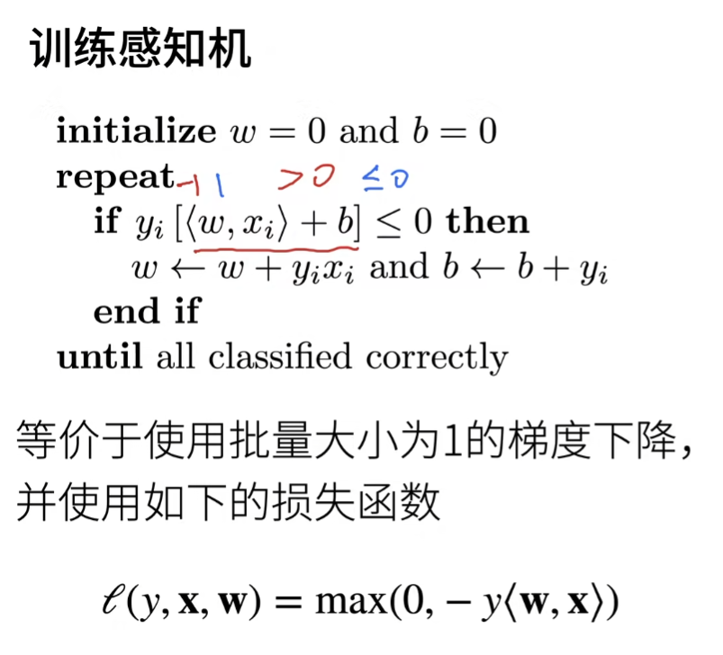

无法解决XOR问题， 因此有了多层感知机。

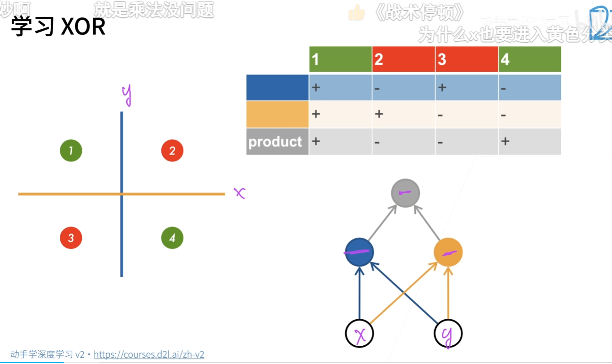

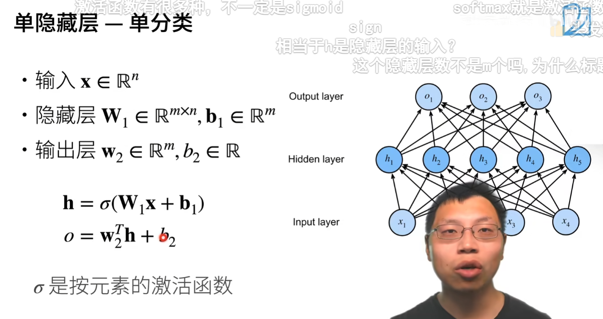

如果没有非线性激活函数，则多层感知机仍然是单层的

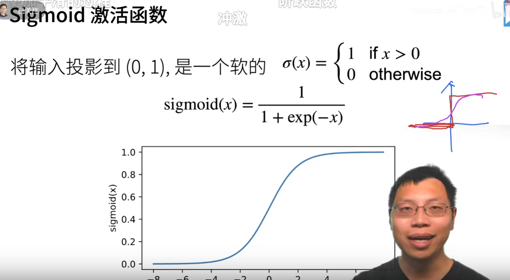

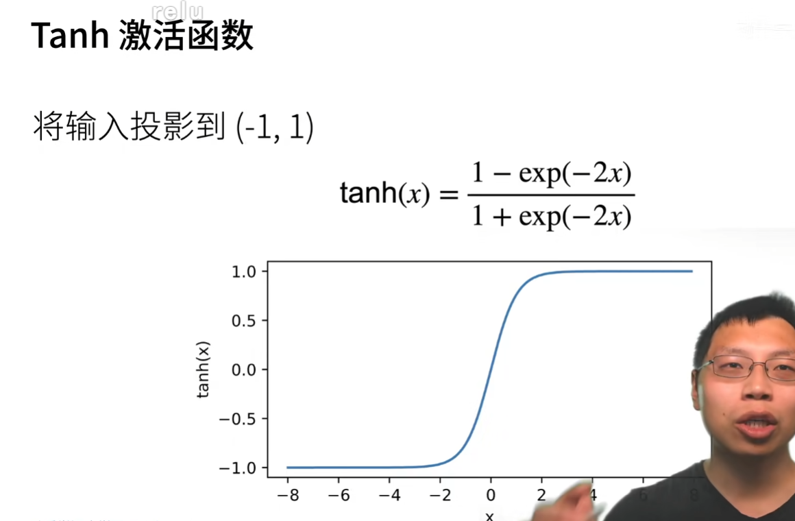

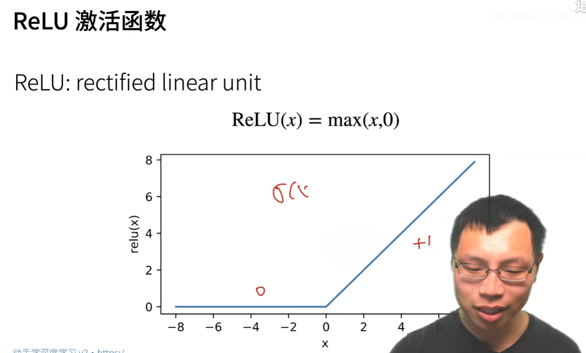

跟感知机换汤不换药，换了个名字。

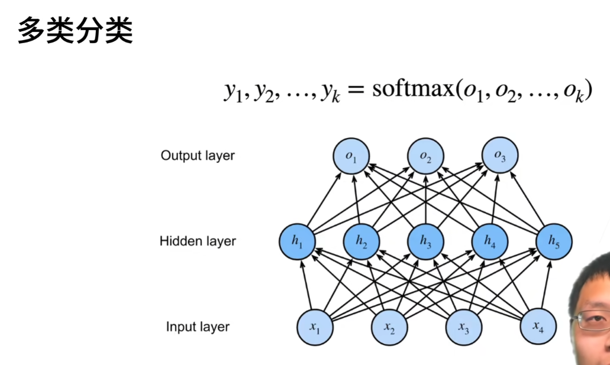

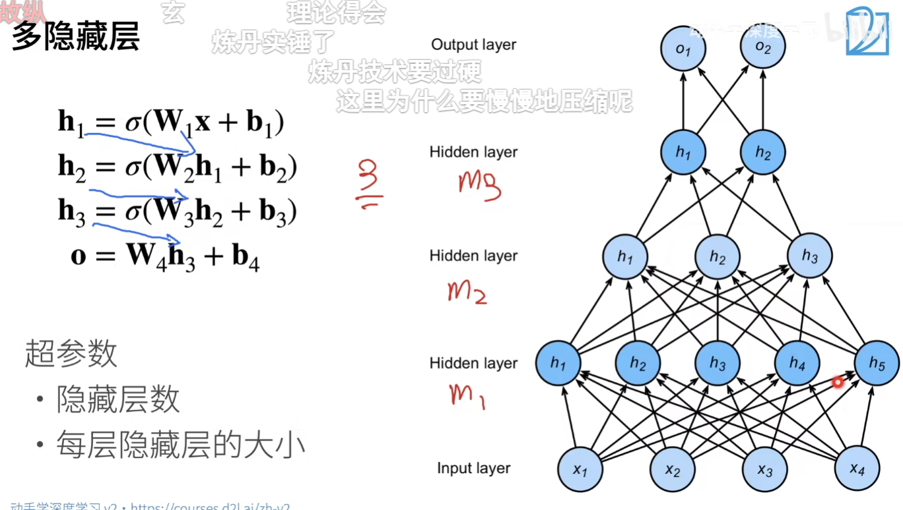

最好先稍微扩张，再慢慢压缩。

## 多层感知机从零开始实现

[notebook](./mlp-scratch.ipynb)

## 多层感知机简洁实现

[notebook](./mlp-concise.ipynb)

激活函数远远没有隐藏层神经元个数等超参数重要，它的作用是引入非线性。

## 模型选择

我们关心的是泛化误差，而不是训练误差。

注意测试集只会使用一次

### K折交叉验证

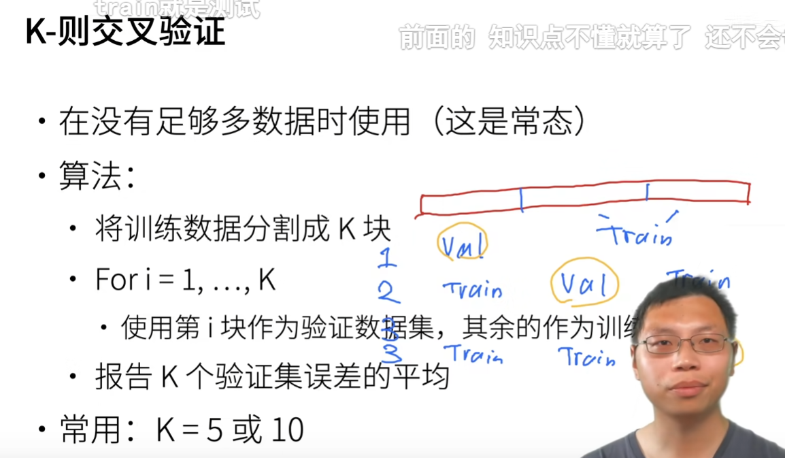

##  欠拟合和过拟合

[notebook](./underfit-overfit.ipynb)

模型容量：模型拟合各种函数的能力。

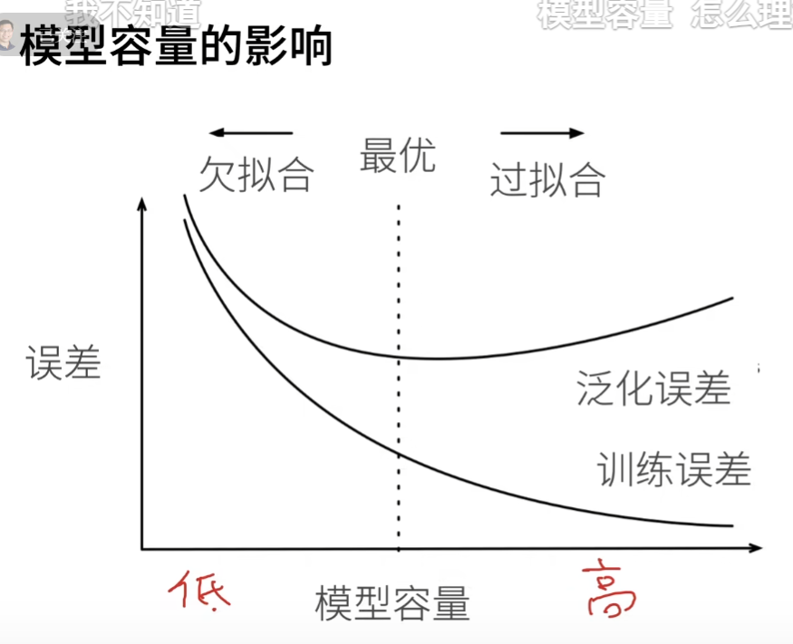

模型的复杂度主要是两个因素

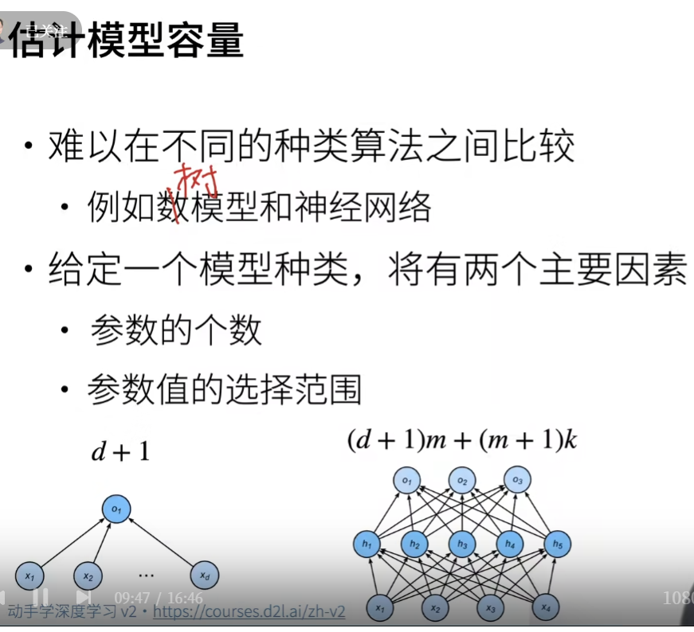

VC维：模型复杂度的一种度量。

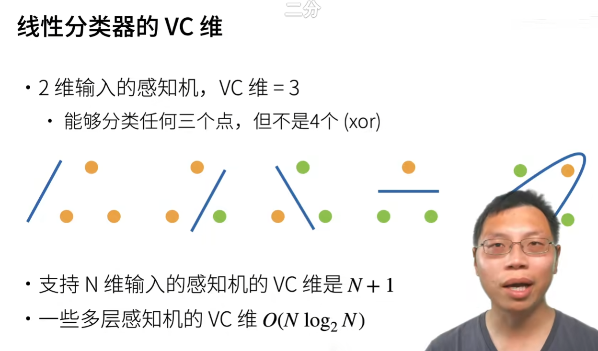

## 正则化方法

正则化就是减少过拟合问题的方法。

### 权重衰退

[notebook](./weight-decay.ipynb)

是一种正则化方法。

权重衰退是一种应对过拟合的常用手段。

L1正则化（L1 Regularization）：也称为L1范数正则化或Lasso正则化。在L1正则化中，通过向模型的损失函数中添加**模型权重绝对值的惩罚项**来实现正则化。L1正则化可以促使一些权重变为零，从而实现特征选择，即某些特征对模型的贡献为零，这有助于简化模型。

L2正则化（L2 Regularization）：也称为L2范数正则化或岭回归（Ridge Regression）。L2正则化通过向损失函数中添加**模型权重平方的惩罚项**来实现正则化。L2正则化使得权重值相对较小，并且对权重的更新更加平滑，有助于防止权重值过大，从而控制模型复杂度。

#### L1正则化

使用均方误差的硬性限制

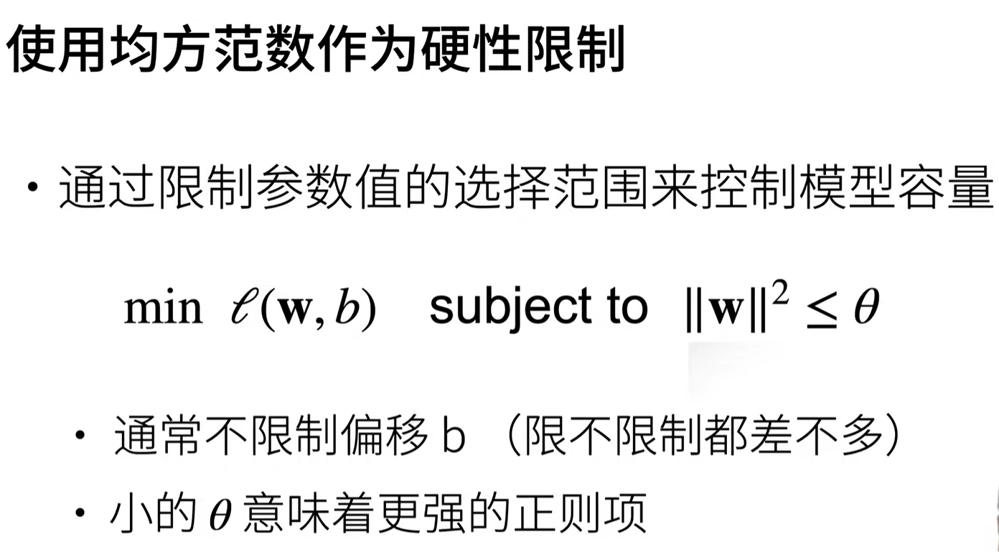

#### L2正则化

**L2正则化**可以看作是对模型权重的**柔性限制**，促使**权重较小**，从而避免模型过度依赖少数特征，从而增强泛化能力。

假设我们的模型有一个损失函数 $J(\theta)$，其中 $\theta$ 是模型的**参数（权重）**。

要添加L2正则化，我们将其表示为以下形式：

$$
J_{\text{regularized}}(\theta) = J(\theta) + \frac{\lambda}{2} \sum_{i=1}^{N} \theta_i^2
$$

其中，$N$ 是模型的总参数数量，$\lambda$ 是控制正则化强度的超参数，$\theta_i$ 是第 $i$ 个参数的值。

上述公式中的 $\frac{\lambda}{2} \sum_{i=1}^{N} \theta_i^2$ 表示**对所有权重的L2范数进行惩罚**。当优化器在训练过程中更新参数时，将**同时考虑损失函数的值**和**权重的L2范数**，从而实现**柔性限制**。

当使用PyTorch时，可以通过在模型的层中使用`weight_decay`参数来添加L2正则化。
`weight_decay`参数会在优化器中自动应用L2正则化，从而实现对权重的柔性限制。

可以通过拉格朗日乘子来证明L2正则化的效果。

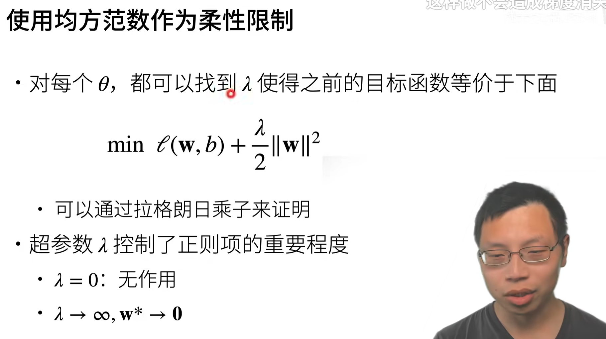

**本质如此**：

求导后，学习率乘以梯度这一项不变。

原来的$W_t$变成了$(1-\eta\lambda)W_t$，这就是权重衰减。

这就是说，每一步先让权重衰减一点点，再通过梯度更新。

$\lambda$ 是超参数。

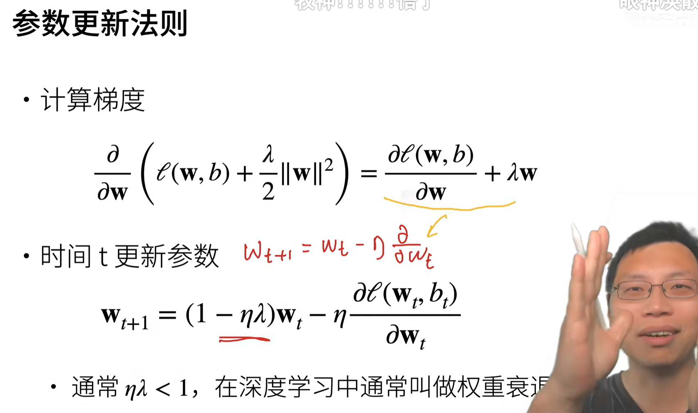

正则都是为了避免过拟合！

相当于**限制了权重的更改空间**。

当模型的参数过多或权重值过大时，模型会变得过于复杂，容易记住训练样本的噪声而忽略数据中的真实模式。

通过使用L2正则化进行权重衰减，损失函数中加入了一个惩罚项，使得模型更倾向于使用较小的权重值，从而减少过拟合的风险。

L2正则化有一种"**缩小特征影响**"的效果。

对于某些特征，如果其对应的权重值非常小甚至趋近于零，那么模型在预测时会忽略这些特征，起到一定程度的特征选择作用。这可以帮助模型更专注于重要的特征，减少对噪声特征的过度拟合。

### 丢弃法

[notebook](./dropout.ipynb)

也是一种正则化方法。

在层之间加入噪音。

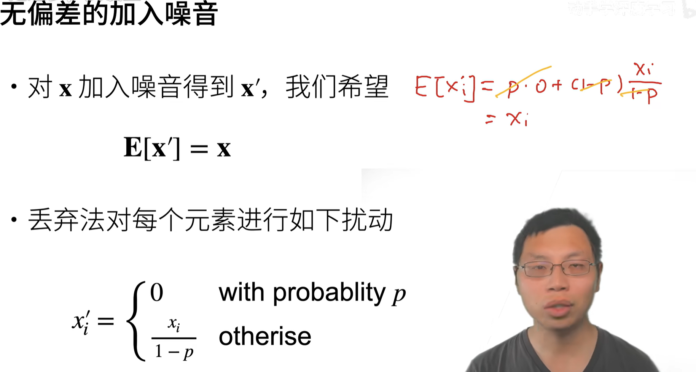

上述所谓无偏差，即为不改变期望。

一定概率将某些神经元置为0，一定概率变大。保证期望不变。

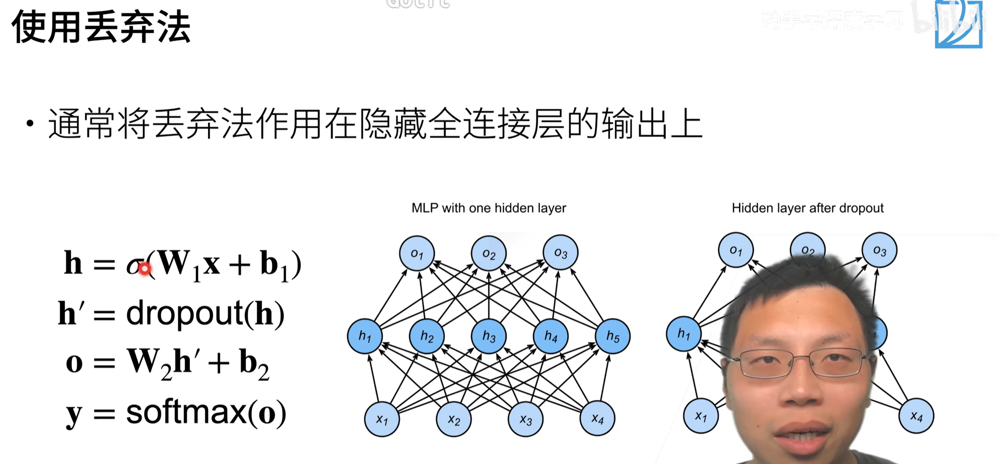

正则化只在训练时使用，推理时不使用。

0.1 0.5 0.9 是最常用的丢弃率.

一般不在CNN等层使用，因为本身就有丢弃的作用。

## 数值稳定性和模型初始化

[notebook](./numerical-stability-and-init.ipynb)

### 数值稳定性

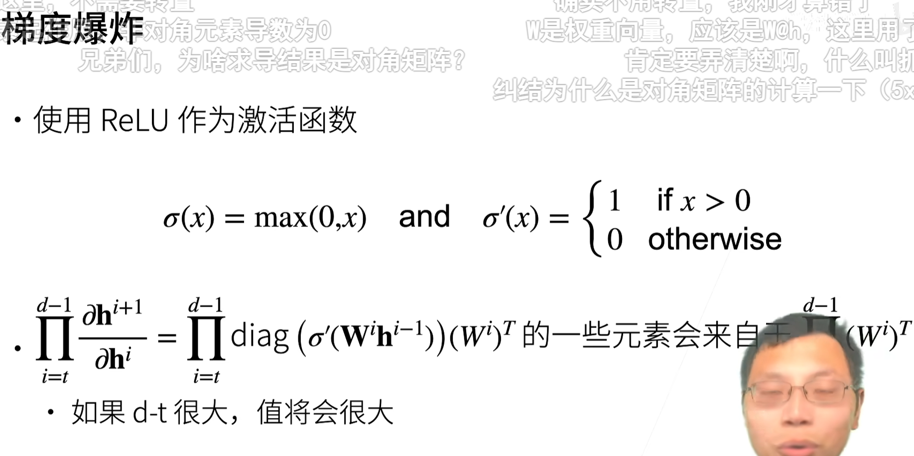

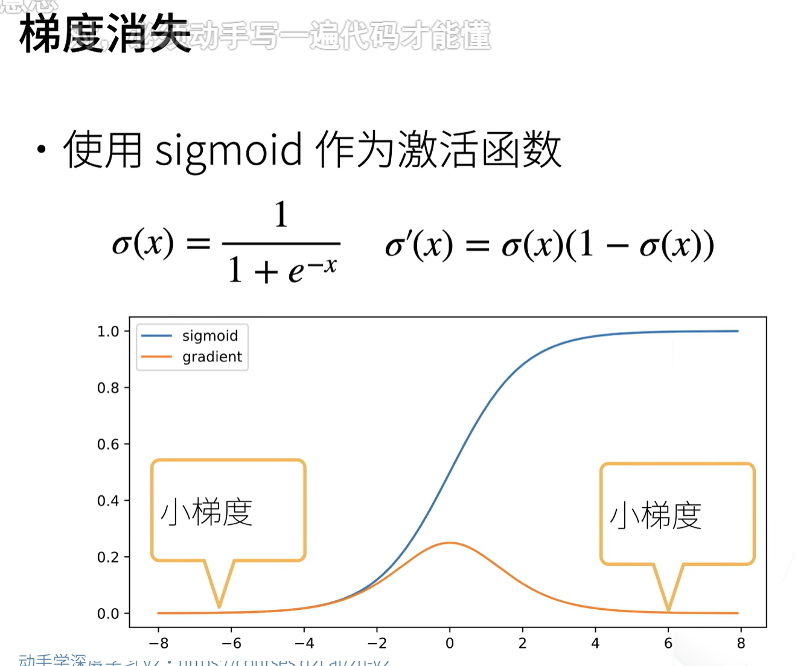

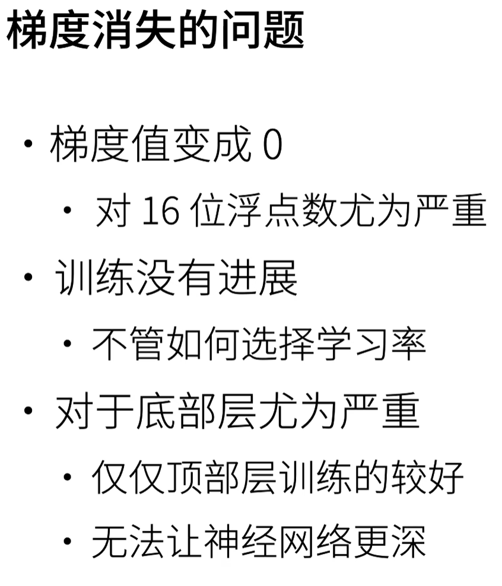

### 模型初始化和激活函数提高数值稳定性

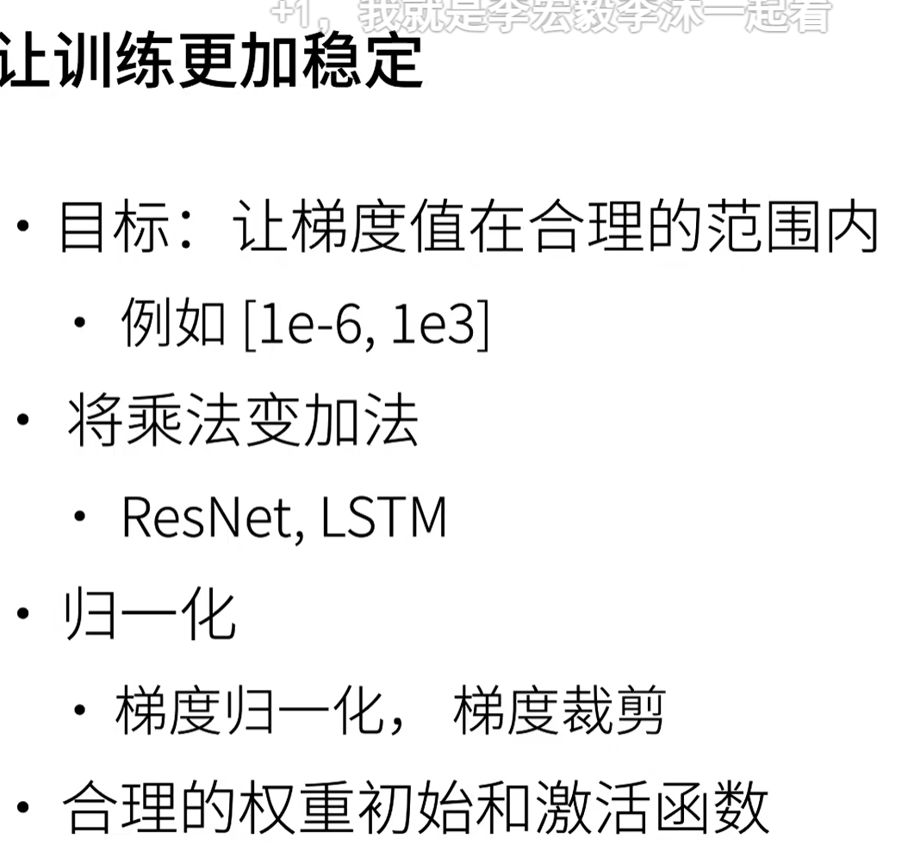

#### 权重初始化

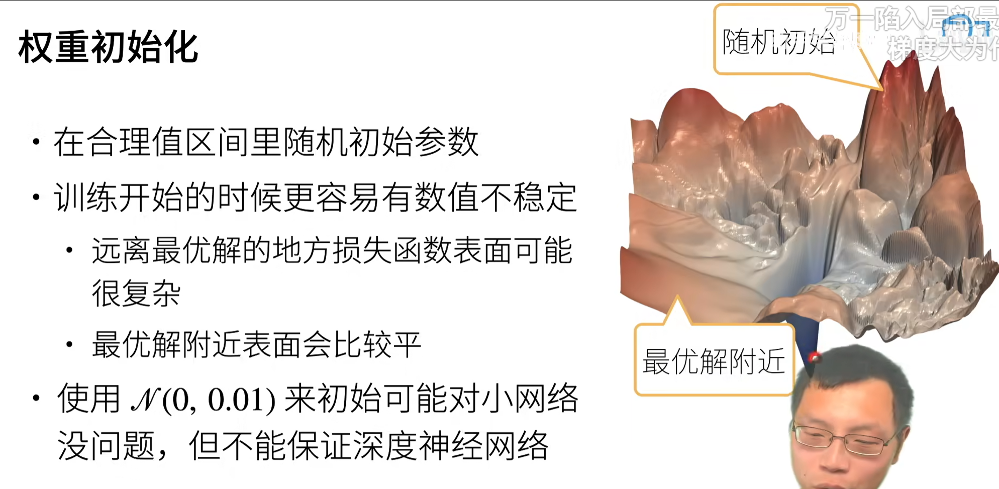

假设没有激活函数的情况下：

所有的权重视为均值为0，方差为$\gamma_t$的独立同分布的随机变量。现在需要求出一个$\gamma_t$使得：

对于第t层（$n_{t-1}$ 为上一层神经元个数，$n_t$ 为本层神经元个数。即权重矩阵为$n_{t-1}\times n_t$。）而言：

正向需要保证输出$h_i^t$和输入$h_i^{t-1}$的方差和均值一样。

反向需要保证$\frac{\partial \ell}{\partial h_i^{t-1}}$和$\frac{\partial \ell}{\partial h_i^t}$的方差和均值一样。

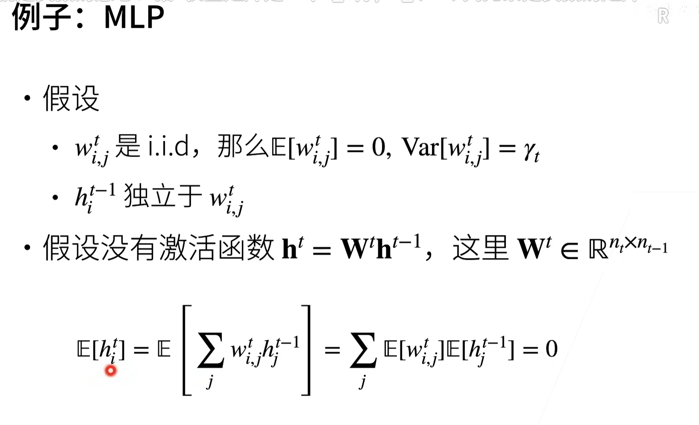

正向需要$n_{t-1}\gamma_t = 1$.

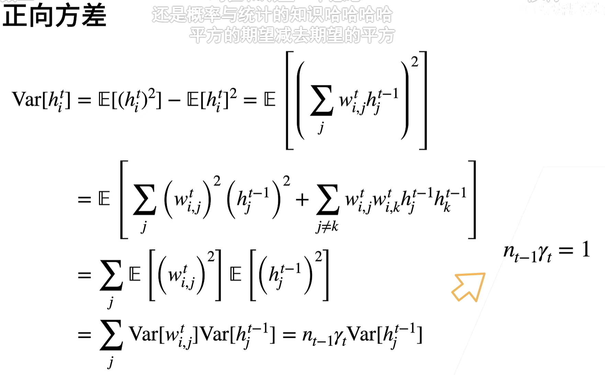

反向需要$n_t\gamma_t = 1$。

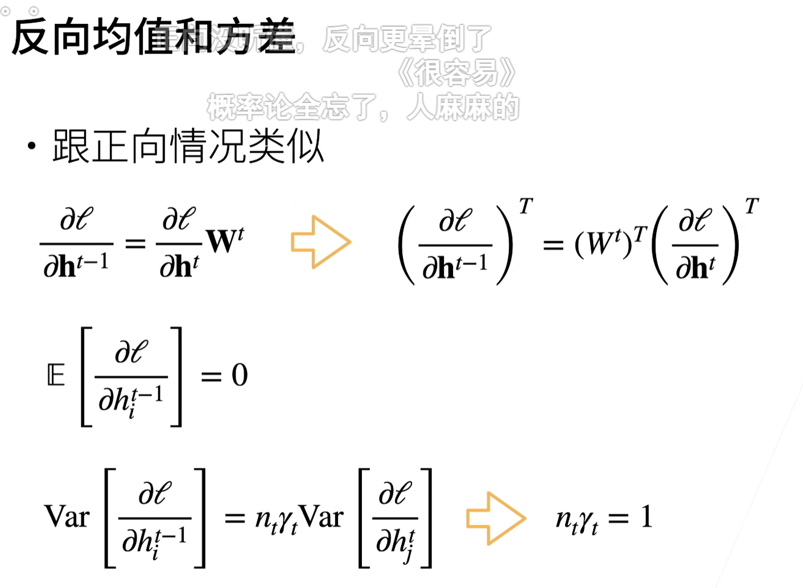

**Xavier初始化方法**。

即使用一种折中的方法。使方差为$\frac{2}{n_{t-1}+n_t}$、均值为0的正态分布。

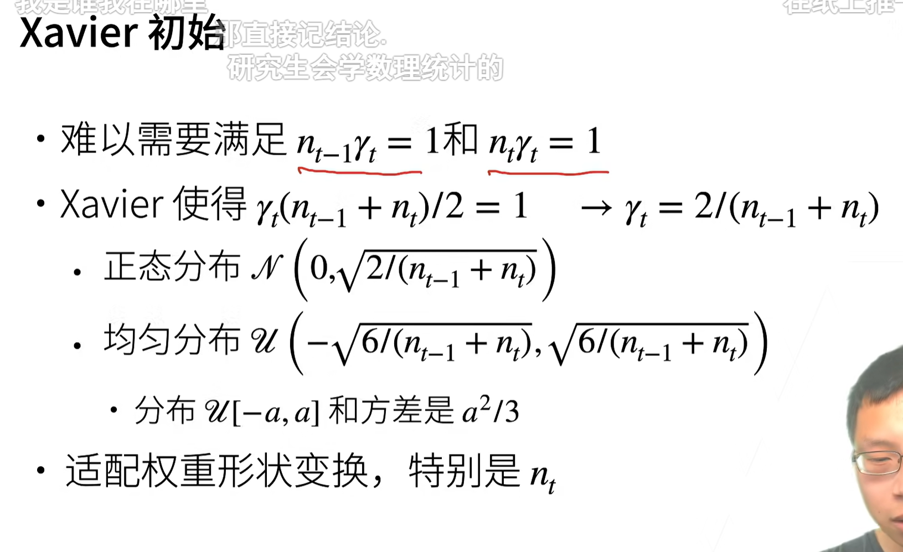

#### 激活函数

如果考虑**激活函数**，那么就是：

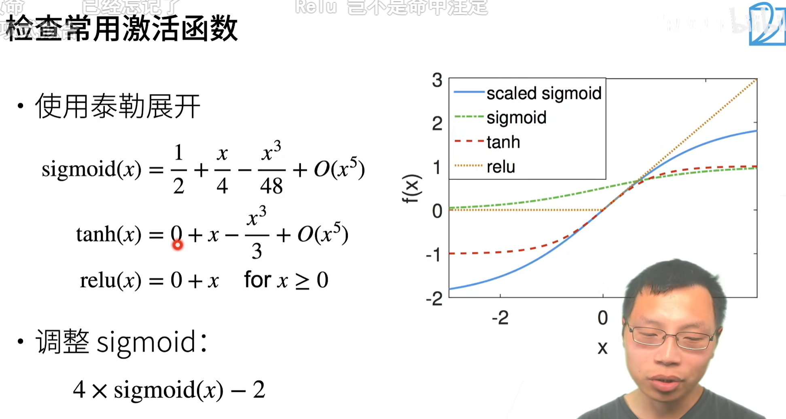

调整sigmoid后能够和tanh和relu一样，近似于没有激活函数的情况。

**总结：**

合理的权重初始化和激活函数能够提升**数值稳定性**，具体表现为：

使得**每一层的输出和梯度**都是方差和均值一致的随机变量。

## Kaggle房价预测

[notebook](./kaggle-house-price.ipynb)